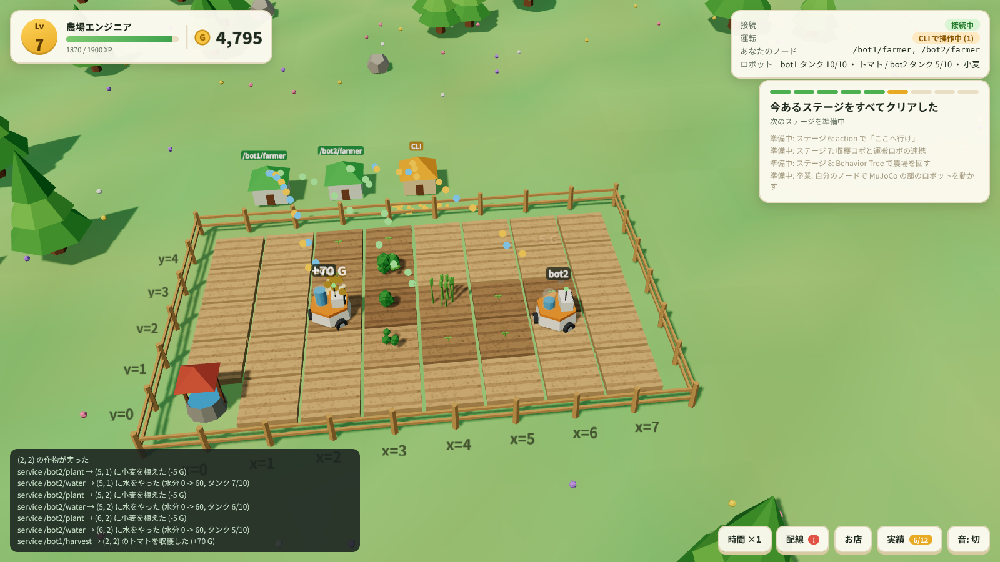

# Publish or Perish

ROS 2 を学ぶための農場ゲーム。農場のロボットを topic と service で動かし、種まき・水やり・収穫で農場を大きくする。
課題は講習の回に対応していて、CLI で手で動かすところから、自分の C++ ノードで 2 台のロボットを無人で回すところまで進む。



| パッケージ | 中身 |
|---|---|
| `publish_or_perish` | 農場のノード (C++) と、ブラウザで見る 3D 画面 (`web/`) |
| `publish_or_perish_answers` | 課題の解答例 (講師用) |

## 遊び方

```bash
cd ~/src26_ws
colcon build --symlink-install --merge-install --packages-select publish_or_perish
ros2 launch publish_or_perish farm.launch.xml
```

ブラウザで http://localhost:8765 を開く (WSL の場合も Windows 側のブラウザで開ける見込み。未確認)。
画面 (`publish_or_perish/web/dist`) がまだなければ, colcon build の前に作る (下の「画面を作る」)。
進み具合は `~/.publish_or_perish/save.txt` に保存される。最初からにするときは `reset:=true`、別の保存先は `save_path:=<path>` を付ける。

途中のステージから試すときは `start_stage:=<番号>` を付ける (前のステージは済みになる)。今の記録を残すため、保存先も分ける。
ステージ 3 を、もう遊んだワークスペースで試し直す例 (別の名前のパッケージを使うので、遊んだ `tutorial_nodes` は変わらない):

```bash
cd ~/src26_ws/src && ros2 pkg create try_nodes
ros2 launch publish_or_perish farm.launch.xml start_stage:=3 package:=try_nodes save_path:=$HOME/.publish_or_perish/try.txt
```

rosbridge が入っていなければ `sudo apt install ros-jazzy-rosbridge-server` で入れる。

### VSCode の中で遊ぶ

`vscode/` に VSCode 拡張がある。VSCode の拡張機能のフォルダにリンクを張って入れ、VSCode のコマンドパレットで「Developer: Reload Window」(ウィンドウの再読み込み) をする。リンクなので、`vscode/` を直すと再読み込みだけで反映される。

```bash
ln -s ~/src26_ws/src/publish_or_perish/vscode ~/.vscode/extensions/fortefibre.publish-or-perish-0.1.0
```

ほかの PC に配るときは `python3 vscode/pack.py` で `vscode/publish-or-perish.vsix` を作り、`code --install-extension publish-or-perish.vsix` で入れる。

- **畑を小窓で開く** (Ctrl+Alt+H、またはステータスバーの課題をクリック): 畑を VSCode の浮動ウィンドウに出し、常に手前に置く。窓を小さくする (幅 560 px 未満か高さ 420 px 未満) と、上に今の課題を 1 行で出し、畑全体が収まる表示になる。最初は 1024×768 で開くので、角をつまんで縮める
- **畑を開く** (コマンドパレットの「Publish or Perish: 畑を開く」): エディタのタブとして開く
- **ステータスバー**: 今のステージ、課題、進み具合、配線の警告を出す。カーソルを乗せると課題の説明とヒントが出る
- **今の課題の説明を開く** (Ctrl+Alt+G、ステータスバーのツールチップ、または畑の「説明を読む」): 課題の説明をエディタの横に Markdown のプレビューで開く

## 大会モード (作成中)

関西春ロボコン 2027 "SAKURA AVENUE" のフィールドで、大会のタスクができるロボット (赤コート) を自由に動かせる。物理は MuJoCo で計算する。得点の判定と試合の進行はまだない。

```bash
pip install --user --break-system-packages mujoco   # MuJoCo の Python 版 (Ubuntu 24.04 は --break-system-packages が要る)
cd ~/src26_ws
colcon build --symlink-install --merge-install --packages-select publish_or_perish
ros2 launch publish_or_perish match.launch.xml
```

ブラウザで http://localhost:8765/match.html を開く。キーで動かせる (画面の左上に一覧)。

ロボット: 450 x 450 mm の全方向に動ける台車, マストを上下するリフト (0〜0.35 m), 前へ伸びるアーム (0〜0.42 m), ボトルを横 3 x 奥 2 に並べてつかむハンド。
アームを縮めると 0.57 x 0.45 x 0.66 m (初期制限 700 mm 角に入る), 伸ばしきると前後 0.99 m (展開制限 1000 mm 角に入る)。重さは 12 kg。

| 名前 | 型 | 向き | 内容 |
|---|---|---|---|
| `/robot/cmd_vel` | `geometry_msgs/msg/Twist` | 送る | 台車の速度 (機体座標, x 前 / y 左)。0.5 秒途切れると止まる。最大 2 m/s, 3 rad/s |
| `/robot/arm/extend` | `std_msgs/msg/Float64` | 送る | アームの伸びの目標 [m] (0〜0.42)。0.4 m/s で動く |
| `/robot/arm/lift` | `std_msgs/msg/Float64` | 送る | リフトの高さの目標 [m] (0〜0.35)。0.3 m/s で動く |
| `/robot/pose` | `geometry_msgs/msg/Pose` | 受ける | 台車の位置 [m] と向き (z 軸まわりのクォータニオン)。原点はフィールドの中心, x は赤コートから青コートへ, y はスタートゾーンから奥へ |
| `/robot/status` | `std_msgs/msg/String` | 受ける | アーム・リフト・持っているボトル・サイコロの目・合図・最後の操作の結果 (JSON。`last_action` は英語の文, `action` はキーと値) |
| `/robot/grab` | `std_srvs/srv/Trigger` | 呼ぶ | ハンドの前に立っているボトル (自チームの桜ボトルと除草剤ボトル) をつかむ。リフトを 0.03 m 以下に下ろしておく。持てるのはサイコロの目の数まで (ルール 5.4) |
| `/robot/place` | `std_srvs/srv/Trigger` | 呼ぶ | ハンドの真ん中のボトルを今の高さで離す (下ろしてから離す) |
| `/robot/throw` | `std_srvs/srv/Trigger` | 呼ぶ | 持っている除草剤ボトルを 1 本, 前へ投げる (前 3.5 m/s, 上 2.5 m/s) |
| `/robot/dice` | `std_srvs/srv/Trigger` | 呼ぶ | ハンドから 0.2 m 以内のサイコロを前へ 1 面転がす |
| `/robot/signal` | `std_srvs/srv/Trigger` | 呼ぶ | 合図 (満開宣言) の灯りを付ける / 消す |
| `/match/reset` | `std_srvs/srv/Trigger` | 呼ぶ | ロボットとオブジェクトを最初の位置に戻す |

- service の結果は response の `message` に英語で返る (できなかった理由も)。画面には日本語の訳が出る
- 台車は木枠 (高さ 89 mm) を越えられない。スタートゾーンは外周と木枠に囲まれていて, 右 (+x) から出る。アームとハンドは何にも当たらない
- 持っているボトルの底は, リフトの高さ + 5 mm。底が 89 mm より低いまま木枠に重なると, そのボトルはその場に落ちる。共通ゾーンへ運ぶときはリフトを上げて木枠を越え, ゾーンの上で下ろしてから置く
- フィールドは `tools/harurobo2027_field.py` が `publish_or_perish/models/harurobo2027/harurobo2027.xml` に書き出す。寸法は運営委員会のフィールド CAD から取った (取り方はスクリプトの先頭)。直したら書き出し直し, `python3 tools/mjcf_export.py publish_or_perish/models/harurobo2027/harurobo2027.xml publish_or_perish/web/public/scenes/harurobo2027` で画面用の形も作り直す

## ステージ

| ステージ | 内容 | 講習 |
|---|---|---|
| 1 手で動かしてみよう | `ros2 topic pub` / `ros2 topic echo` / `ros2 service call` | 入門 第8・9回 |
| 2 ワークスペースを作ろう | `mkdir -p ~/src26_ws/src`、`ros2 pkg create`、`colcon build`、`~/.bashrc` | 実践 第1回 |
| 3 最初のノードを動かそう | `hello_node` を書き、package.xml と CMakeLists.txt を ament_cmake_auto にし、ビルドして `ros2 run` | 実践 第2・3・4回 |
| 4 ノードで topic と service を使おう | 畑の横の看板を相手に、Publisher・Subscriber・受けて送る・service の client を 1 つずつ書く (畑とロボットは使わない) | 実践 第2・5・6・7回・入門 第9回 |
| 5 自分のノードでロボットを動かそう | ステージ 4 と同じ書き方で `/bot1/cmd_vel` を送り、畑を巡回する | 実践 第6回 |
| 6 畑を見て判断しよう | Subscriber と service の client で無人農場 | 実践 第7回 |
| 7 パラメータで作物を選ぼう | `ros2 param set /farm bot1.seed tomato` | 入門 第10回・実践 第12回 |
| 8 ロボットを 2 台にしよう | namespace と launch で同じノードを 2 つ動かす | 実践 第11回 |

ステージ 2・3 は農場がファイルを見て判定する。調べるのは `~/src26_ws` の `tutorial_nodes` (変えるときは `workspace:=<path>` と `package:=<名前>`。課題文のパスとコマンドもその値になる)。

## 画面の機能

- **説明** (課題の「説明を読む」): その課題でやること、使う関数やコマンドの意味、うまくいかないときの見方を出す。ステージ 4 は課題とは別の例 (`/chatter` の talker など) で書き方を説明し、ステージ 5〜8 は完成したコードを載せず、考え方と要の数行を畳んだヒント (`<details><summary>題</summary>` 〜 `</details>`) にしている (解答例は講師用の `publish_or_perish_answers`)。ステージ 3 は決まった形なので全文を載せる。講習の資料を開かなくても進められるようにするためのもの。中身は `publish_or_perish/web/public/guide/ja/<課題の id>.md` で、文中の `~/src26_ws` と `tutorial_nodes` は起動引数の `workspace:=` と `package:=` の値に置き換えて出す。ターミナルに出る文は `{{msg:キー|名前=値}}` と書くと、英語の原文と訳になる (下の「ターミナルの文と訳」)。今あるのはステージ 3〜8 (ステージ 1・2 は課題の欄のコマンドだけで進められるので付けていない。ステージ 4 は「看板に文字を出す」だけ)
- **点検** (課題パネルの上、VSCode では「問題」パネル): ターミナルにはエラーが出ないか、出ても原因が分かりにくい間違いを、ファイル・`~/.bashrc`・動いているプロセスを外から見て見つける。ファイルは読むだけで書き換えない

  | 見つける間違い | 調べ方 |
  |---|---|
  | `src` やホームで `colcon build` した | その場の `build/COLCON_IGNORE`、`install/setup.bash` |
  | 最初のビルドで `--merge-install` を付け忘れた | `install/.colcon_install_layout` が `isolated` |
  | `--symlink-install` を付け忘れた | `install/share/<pkg>/package.xml` がリンクでない |
  | パッケージを `src` の外・パッケージの中に作った | `package.xml` の場所 |
  | ワークスペースの名前の打ち間違い | ホームにある、`src` を持つ似た名前 (編集距離 2 以内) のディレクトリ |
  | `~/.bashrc` の source の重複・打ち間違い・相対パス | `~/.bashrc` の各行と、source 先があるか |
  | .cpp を `CMakeLists.txt` に書いていない | `src/*.cpp` と `add_executable` の突き合わせ |
  | `CMakeLists.txt` に書いたファイルがない | 同上 |
  | `ament_auto_...` を使うのに package.xml が `ament_cmake` のまま | `<buildtool_depend>` |
  | include したパッケージが package.xml にない | `#include <pkg/...>` と `<depend>` の突き合わせ |
  | ビルドに失敗した | `log/latest_build` の最初のエラーを取り出し、よくあるものは日本語で意味を出す |
  | 直したあとビルドしていない | ソースと実行ファイルの更新時刻 |
  | ビルドし直したのに古いプロセスが動いている | `/proc/<pid>/exe` が `(deleted)`、または起動時刻より実行ファイルが新しい |
  | `ROS_DOMAIN_ID` が農場と違う | 動いているプロセスの環境変数 (`/proc/<pid>/environ`) |

- **配線図** (右下の「配線」): topic ごとに送り手・受け手・頻度・データ量を出す。受け手のいない topic、似た名前の打ち間違い、型や QoS の食い違いを警告する
- **ノードの小屋**: 自分のノードと CLI ごとに畑の奥へ小屋が建ち、メッセージ 1 つが光の粒 1 つになって飛ぶ。届かない粒は小屋の前に落ちる
- **時間の早送り** (右下の「時間」): 作物と水分の時間だけを 2 倍・4 倍にする。ロボットの動きは実時間のまま
- **お店**: 畑の拡張、新しい作物、タンク、2 台目のロボット

## 解答例 (講師用)

```bash
ros2 run publish_or_perish_answers stage4_patrol                          # ステージ 5 (名前は番号を 1 つ足す前のまま)
ros2 run publish_or_perish_answers stage5_farmer --ros-args -r __ns:=/bot1  # ステージ 6・7
ros2 launch publish_or_perish_answers stage7_two_bots.launch.xml           # ステージ 8
```

## ロボットとのやりとり

| 名前 | 型 | 向き | 内容 |
|---|---|---|---|
| `/bot1/cmd_vel` | `geometry_msgs/msg/Twist` | 送る | 速度 (機体座標, x 前 / y 左)。0.5 秒途切れると止まる |
| `/bot1/pose` | `geometry_msgs/msg/Pose` | 受ける | 位置 `position` [m] と向き `orientation` (z 軸まわりのクォータニオン。角度 [rad] は `2 * atan2(z, w)`)。1 マス = 1 m |
| `/bot1/tank` | `std_msgs/msg/Int32` | 受ける | 水タンクの残り。井戸 (マス (0, 0)) に立つと満タン |
| `/bot1/plant` `/bot1/water` `/bot1/harvest` | `std_srvs/srv/Trigger` | 呼ぶ | 足元のマスに種まき / 水やり / 収穫 |
| `/bot2/...` | 同上 | | 2 台目を買うと増える |
| `/field/moisture` | `nav_msgs/msg/OccupancyGrid` | 受ける | マスの水分 0〜100。`data[y * width + x]` |
| `/field/crops` | `nav_msgs/msg/OccupancyGrid` | 受ける | -1: なし, 0〜99: 生育中, 100: 実った, -2: 枯れた |
| `/money` | `std_msgs/msg/Int64` | 受ける | 所持金 |
| `/board/text` | `std_msgs/msg/String` | 送る | 看板に出す文字 (先頭の 40 文字) |
| `/board/number` | `std_msgs/msg/Int32` | 受ける | 看板が 2 秒ごとに出す 1〜50 の数 |
| `/board/answer` | `std_msgs/msg/Int32` | 送る | `/board/number` の 2 倍なら正解 (1 つの数に 1 回だけ数える) |
| `/board/bell` | `std_srvs/srv/Trigger` | 呼ぶ | 看板の鐘を鳴らす。response の message に何回目か |
| パラメータ `/farm` の `bot1.seed` | string | 設定 | 植える作物 (wheat / tomato / pumpkin, お店で解禁) |

## 課題の判定

農場は ROS のグラフを見て、誰が操作したかを判定する。

- `ros2 topic pub` などの CLI のノード (`_ros2cli_*`) と、自分で書いたノードを区別する
- CLI のノードがなく、自分のノードだけが動いているときは「無人運転中」になる
- `ros2 topic echo` や rqt_graph、RViz、`ros2 bag record` を使うと解ける隠し実績がある

## ターミナルの文と訳

ターミナルに出る文 (service の返事、`ros2 param set` で断った理由、起動のログ) は英語にしている。
ROS のエラーと同じく英語で読み、画面とガイドが訳を添える。
画面にだけ出る文 (課題、点検、お店、実績、通知) は、農場からキーと値で送り、画面が訳す。

文はすべて訳の表 `publish_or_perish/web/public/i18n/<言語>.json` にある。

| 表 | 中身 |
|---|---|
| `en.json` | ターミナルに出る文の元 (`srv` `param` `console` `crop` `match`)。C++ はビルドのときにここから `messages_en.hpp` を作り (`cmake/gen_messages.py`)、`match_sim.py` は起動時に読む |
| `ja.json` | すべての文の日本語。画面にだけ出る文はここが元 (英語の画面はまだないので、英語の表にない文は日本語で出す) |

- 文を足すときは、C++ では `Msg{"キー", {{"名前", 値}}}`、`match_sim.py` では `msg('キー', 名前=値)` と書き、表に `{{名前}}` を使った文を足す。値には、それ自体を訳す文 (例: 作物の名前 `Msg{"crop.wheat"}`) も渡せる
- 表と使う側が合っているかは `pnpm test` (キーがあるか、埋め込みの名前が同じか) と、C++ の `test_messages` (英語の文が作れるか。`colcon test --merge-install --packages-select publish_or_perish`) で確かめる
- 画面の言語は `?lang=en` で変えられる (試すとき用)。VSCode の中では VSCode の表示言語になる
- VSCode 拡張そのものの文言は `vscode/package.nls*.json` と `vscode/l10n/` にある

## 画面を作る

画面のソースは `publish_or_perish/web/` にあり (React, three.js, TypeScript), ビルドした `web/dist/` を colcon build が share へ入れる。
`web/dist/` は git に入れない。ビルドは Docker の中で行うので, ROS の環境に Node は要らない。

```bash
cd ~/src26_ws/src/publish_or_perish/publish_or_perish
docker build -f web/Dockerfile --output type=local,dest=web/dist .   # テストも走る
cd ~/src26_ws && colcon build --symlink-install --merge-install --packages-select publish_or_perish
```

出力のファイル名は毎回同じなので, `--symlink-install` で入れたあとは, 画面を直して `docker build` し直すだけで反映される (ファイルが増えたときは colcon build し直す)。

画面を直すときは, 手元に Node (24 以上) と pnpm を入れて, 農場を起動したまま Vite の開発用サーバーを使うと, 保存するたびに画面が変わる。

```bash
cd publish_or_perish/web
pnpm install
pnpm dev          # http://localhost:5173 (rosbridge の 9090 に直接つなぐ)。大会モードは /match.html
pnpm test         # ガイドの描画, 記録した /farm/state がスキーマに合うか, 訳の表と C++ / match_sim.py / 画面が合っているか
pnpm typecheck
```

`/farm/state` の形を変えたら, `packages/ros/src/farm.ts` のスキーマを直し, `packages/ros/src/fixtures/` に記録し直した状態を置く (`ros2 topic echo --once --field data /farm/state --full-length` の出力)。

## 構成

- `publish_or_perish/src/world.cpp`: 農場の規則 (ROS に依存しない)
- `publish_or_perish/src/progress.cpp`: 課題・実績・レベル
- `publish_or_perish/src/farm_node.cpp`: ROS の topic / service、グラフの読み取り、保存、画面用の状態 (`/farm/state`)
- `publish_or_perish/web/`: 画面 (React, three.js, TypeScript)。rosbridge (9090) で `/farm/state` を読み、`/farm/ui` にお店と早送りの操作を送る。作り方は「画面を作る」、設計は `docs/design/web-architecture.md`
- `vscode/`: VSCode 拡張 (畑を小窓で開く、ステータスバーに課題を出す)。colcon は読まない (`COLCON_IGNORE`)
- `publish_or_perish/web/match.html`: 大会モードの見た目の試作 (動きはまだない)
- `tools/mjcf_export.py`: MuJoCo のモデル (MJCF) から大会モードの画面用の形を書き出す。出力先 `web/public/scenes/` は git に入れない (春ロボ 2027 のフィールドだけは入れる)

```bash
python3 tools/mjcf_export.py ~/src26_ws/src/src_ros2/src_ros2_simulation/models/src.xml publish_or_perish/web/public/scenes/src2026
```
